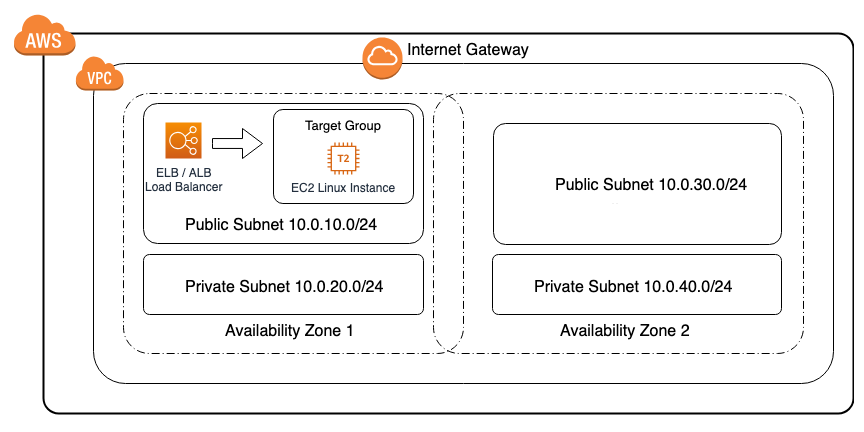

# aws-elb-to-ec2-target-group-cf-template

## Description:

This <a href="https://aws.amazon.com/cloudformation/" target="_blank">AWS CloudFormation</a> solution deploys an <a href="https://aws.amazon.com/vpc/" target="_blank">AWS VPC</a> environment that has 2 public zones and 2 private zones with an <a href="https://docs.aws.amazon.com/elasticloadbalancing/latest/application/load-balancer-target-groups.html" target="_blank">EC2 Target Group</a> that has one <a href="https://aws.amazon.com/ec2/" target="_blank">EC2</a> linux instance in it and a <a href="https://aws.amazon.com/elasticloadbalancing/" target="_blank">AWS ELB (ALB)</a> load balancer routing traffic to it.

The AWS CloudFormation template creates a AWS VPC with 2 public subnets and 2 private subnets with an EC2 Target Group that has one EC2 linux instance running Apache on port 80 in it and a public facing ELB (ALB) routing traffic on port 80 to the EC2 target group.

AWS Virtual Private Cloud (Amazon VPC) lets you provision a logically isolated section of the AWS Cloud where you can launch AWS resources in a virtual network that you define.

AWS Elastic Load Balancing automatically distributes incoming application traffic across multiple targets, such as Amazon EC2 instances, containers, IP addresses, and Lambda functions. It can handle the varying load of your application traffic in a single Availability Zone or across multiple Availability Zones.

Each AWS Target Group is used to route requests to one or more registered targets. When you create each listener rule, you specify a target group and conditions. When a rule condition is met, traffic is forwarded to the corresponding target group. You can create different target groups for different types of requests.

AWS Elastic Compute Cloud (Amazon EC2) is a web service that provides secure, resizable compute capacity in the cloud

AWS CloudFormation provides a common language for you to describe and provision all the infrastructure resources in your cloud environment.

## AWS Resource Costs

As with most AWS services you will incur costs for usage. For this CloudFormation template the resources that incur costs are as follows.

* Pricing:

   * <a href="https://aws.amazon.com/elasticloadbalancing/pricing/" target="_blank">ELB Pricing</a> resource used in example: *1 Application Load Balancer*
   * <a href="https://aws.amazon.com/ec2/pricing/on-demand/" target="_blank">EC2 pricing</a> resource used in example: *1 t2.nano*

## Prerequisites

* <a href="https://aws.amazon.com" target="_blank"> Amazon Web Services Account</a>
* <a href="https://aws.amazon.com/iam/" target="_blank">IAM</a> user with the following permissions:
   * AWSCloudFormationReadOnlyAccess
   * AmazonVPCFullAccess
   * AmazonEC2FullAccess
* An <a href="https://docs.aws.amazon.com/AWSEC2/latest/UserGuide/ec2-key-pairs.html" target="_blank">EC2 Key Pair</a> in the region you are deploying
* This example works without modification in the following regions: us-west-1, us-west-2, us-east-1, us-east-2

## CloudFormation Template

* The CloudFormation Template is available on GitHub:
   * <a href="https://github.com/getcft/aws-elb-to-ec2-target-group-cf-template" target="_blank">aws-elb-to-ec2-target-group-cf-template</a>

## Deploy the CloudFormation Template

* AWS Management Console

   * Login to *AWS Management Console*
   * Launch under *CloudFormation* your *elb-to-ec2-target-group-cf-template.yml* (included in this repo)

* CloudFormation Fields:

   * *Stack name* (Enter a name to associate to your AWS ELB / Target Group deployment)
   * SSHKeyName (EC2 Key Pair used for EC2 Instance) *Next*
   * Continue choosing *Next* and then *Create* (it may take several mintues to create resources)

## Results of the CloudFormation Template

In the *AWS Management Console* you should be able to *verify* the following have been created.

* Resources Created:
  * 1 Public Subnet 10.0.10.0/24 (in Zone A, with 254 usable IP's)
  * 1 Private Subnet 10.0.20.0/24 (in Zone A, with 254 usable IP's)
  * 1 Public Subnet 10.0.30.0/24 (in Zone B, with 254 usable IP's)
  * 1 Private Subnet 10.0.40.0/24 (in Zone B, with 254 usable IP's)
  * 5 Route table entries to route traffic either within 10.0.0.0/16 or to the Internet Gateway for outbound
  * 1 Internet Gateway (for all outbound traffic)
  * 1 ELB Security Group with Port 80 open to everyone
  * 1 EC2 Security Group with Port 22 open to everyone and Port 80 open to the Load Balancer
  * 1 ELB Application Load Balancer
  * 1 EC2 t2.nano linux instance running Apache
  * 1 EC2 Target Group

You can find in the CloudFormation Outputs section the "ALBHostName" copy the hostname from the "Value" column and paste it into a browser you should see the word "Healthy" return.

## Best Practices

* You would normally put your EC2 instance or instances in a private subnet but to save costs for this example we didn't provision a NAT Gateway but needed to install Apache so we elected to put it in a public subnet.
* For traffic that does not need to be reachable from outside your VPC private network space you can provision ELB to be internal versus this example where ELB is public internet facing.
